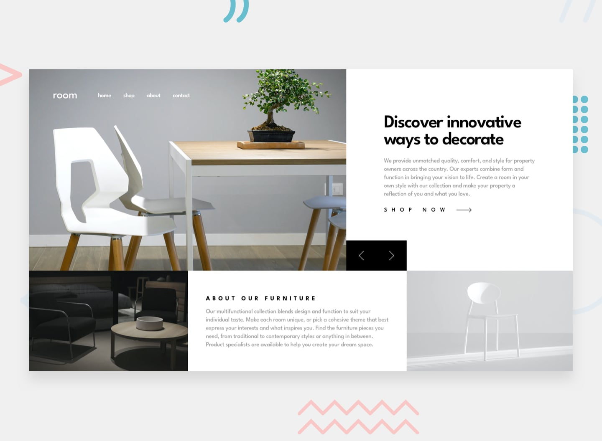

# Frontend Mentor - Room homepage

 users should be able to:

- View the optimal layout for the site depending on their device's screen size
- See hover states for all interactive elements on the page
- Navigate the slider using either their mouse/trackpad or keyboard

## Deploying project
view the live website : https://room-homepage-master-beryl.vercel.app/

## Submitting your solution

you can view the challenge and my solution on frontend mentor : https://www.frontendmentor.io/solutions/csshtmljs-mABUstwGjL

